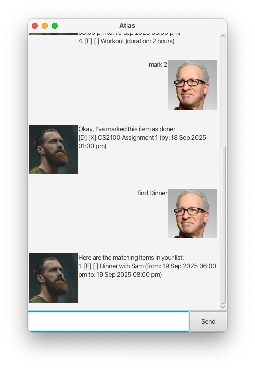

    # Atlas User Guide

Atlas is a desktop app for managing your todos and events, optimised for use via a Command Line Interface (CLI) while still having the benefits of a Graphical User Interface (GUI).

## Features

### ℹ️ Notes about the command format:

- Words in `UPPER_CASE` are the parameters to be supplied by the user. E.g. in `todo NAME`, `NAME` is a parameter which can be used as `todo Read a book`.
- All dates are in the following format: `dd/MM/yyyy HH:mm`, where the time is in the 24-hour format.

### Viewing help: [Any command]

Typing in anything other than the prescribed commands will show a message explaining the various command formats.

### List all items: `list`

Lists all item in the list.

**Format**: `list`

### Adding a todo: `todo`

Adds a new todo to the list.

**Format**: `todo NAME`

**Example**: `todo Read a book`

### Adding a deadline: `deadline`

Adds a new deadline to the list.

**Format**: `deadline NAME /by DEADLINE`

**Example**: `deadline CS2100 Assignment 1 /by 18/09/2025 13:00`

### Adding an event: `event`

Adds a new event to the list.

**Format**: `event NAME /from START_DATE /to END_DATE`

**Example**: `event Dinner with Sam /from 19/09/2025 18:00 /to 19/09/2025 20:00`

### Adding a fixed duration todo: `fixedDuration`

Adds a new fixed duration todo to the list.

**Format**: `event NAME /duration DURATION`

- `DURATION` must be an integer greater than 0.

**Example**: `fixedDuration Workout /duration 2`

### Marking an item as done: `mark`

Marks an item as done.

**Format**: `mark ITEM_NUMBER`

- `ITEM_NUMBER` must be an integer between 1 and the number of tasks.

**Example**: `mark 2`

### Marking an item as not done: `unmark`

Marks an item as not done.

**Format**: `unmark ITEM_NUMBER`

- `ITEM_NUMBER` must be an integer between 1 and the number of tasks.

**Example**: `unmark 3`

### Deleting an item: `delete`

Deletes an item from the list.

**Format**: `delete ITEM_NUMBER`

- `ITEM_NUMBER` must be an integer between 1 and the number of tasks.

**Example**: `delete 4`

### Searching for an item: `find`

Finds all items with the name containing the provided `SEARCH_STRING`

**Format**: `find SEARCH_STRING`

**Example**: `find Dinner`
